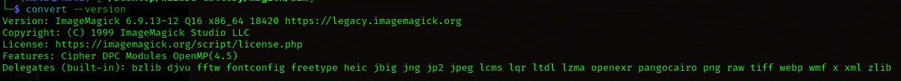
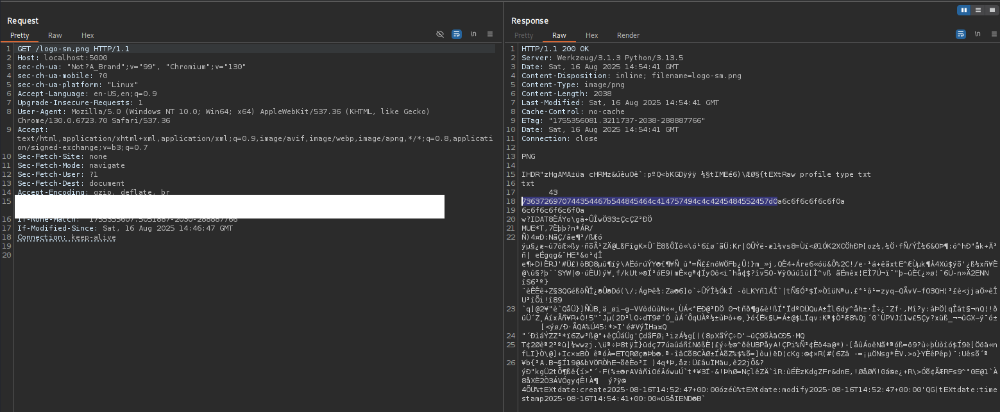
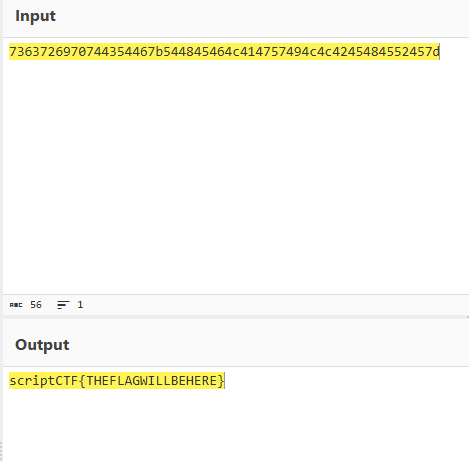

<h3>Description</h3>
The council's top priority is to protect the flag, no matter the cost. Oh hey look, it's a photo gallery. What could go wrong?

<h3>TL;DR</h3>

1. Path Traversal in File Upload;
2. ImageMagick CVE-2022-44268;
3. We make a picture with it and then change the actual logo.png;
4. Go to logo-sm.png, unhex the value in the response;
5. The task is solved

<h3>Solve</h3>
We have the source code of the web application. The directories are:

- magick - with the compiled code of imagemagick;
- public - some html files;
- uploads - it's empty and it is the place, where our uploaded pictures go.

Also, in the root of the application there is logo.png, main.py and flag.txt, which we need to read. Let's see what we have in main.py. <br />
First interesting part is that we have the blacklist and the whitelist of file extensions

```python
ALLOWED_EXTENSIONS = {'png', 'jpg', 'jpeg', 'gif', 'bmp', 'webp'}

BLOCKED_EXTENSIONS = {'exe', 'jar', 'py', 'pyc', 'php', 'js', 'sh', 'bat', 'cmd', 'com', 'scr', 'vbs', 'pl', 'rb', 'go', 'rs', 'c', 'cpp', 'h'}
```

So if we wiil try to provide some of this blacklisted extensions, we will truncate all the stuff in upload folder that can help us in our exploitation

```python
def wipe_upload_directory():
    if os.path.exists(UPLOAD_FOLDER):
        for filename in os.listdir(UPLOAD_FOLDER):
            file_path = os.path.join(UPLOAD_FOLDER, filename)
            try:
                if os.path.isfile(file_path):
                    os.unlink(file_path)
            except Exception as e:
                pass
```

We are moving forward to the function logo_small

```python
@app.route('/logo-sm.png')
def logo_small():
    # A smaller images looks better on mobile so I just resize it and serve that
    logo_sm_path = os.path.join(app.config['UPLOAD_FOLDER'], 'logo-sm.png')
    if not os.path.exists(logo_sm_path):
        os.system("magick/bin/convert logo.png -resize 10% " + os.path.join(app.config['UPLOAD_FOLDER'], 'logo-sm.png'))
    return send_from_directory(app.config['UPLOAD_FOLDER'], 'logo-sm.png')
```

Its main functionality is to convert the logo.png with imagemagick convert to a smaller picture that is saved in uploads folder with the name logo-sm.png. Looks interesting, because ImageMagick traditionally has a lot of vulnerabilities, so we just need to check up the version. First of all I tried to run convert binary with --version flag and got 6.9.3-12

Then I watched the configure.xml file with a version string 7.1.0 and lib-version 7.1.0-49
```xml
<configure name="LIB_VERSION_NUMBER" value="7,1,0,49"/>
```
Google said that there are two vulnerabilities - CVE-2022-44267 and CVE-2022-44268
The main problem is that ImageMagick uses parameter 'profile' from metadata of the image at the moment of the converting it and then in the result we have the hex in the output result.
That's why I focused the attention to the function logo-sm.png, that can help us in getting the flag. <br />
But how can we exploit this, when it's hardcoded logo.png in the os.system command? Let's move forward and find what we can do
The main function of the application is upload_file, which is available on /upload with POST.

```python
def upload_file():
    # Can't upload nothing, right?
    if 'file' not in request.files:
        return jsonify({'success': False, 'message': 'No file selected! Please choose a magical image to upload.'}), 400
        
    file = request.files['file']
    
    if file.filename == '':
        return jsonify({'success': False, 'message': 'No file selected! Please choose a magical image to upload.'}), 400

    # Prevent uploading dangerous files
    if '.' not in file.filename:
        wipe_upload_directory()
        return jsonify({'success': False, 'message': '🚨 ATTACK DETECTED! Suspicious file without extension detected on the union network. All gallery files have been wiped for security. The Sorcerer\'s Council has been notified.'}), 403

    if is_blocked_extension(file.filename):
        wipe_upload_directory()
        return jsonify({'success': False, 'message': '🚨 ATTACK DETECTED! Malicious executable detected on the union network. All gallery files have been wiped for security. The Sorcerer\'s Council has been notified.'}), 403
```

In this part of code there are some security checks - we can't give empty body without any file, can't give the file without a dot in it's name and can't upload bad extensions. 
Next:

```python
...
if file and allowed_file(file.filename):
        original_filename = file.filename
        file_path = os.path.join(app.config['UPLOAD_FOLDER'], original_filename)
        file.save(file_path)
        file_size = get_file_size_mb(file_path)
        return jsonify({
            'success': True,
            'message': f'🎉 Spell cast successfully! "{original_filename}" has been added to the gallery ({file_size} MB)',
            'redirect': '/gallery'
        })
    else:
        return jsonify({'success': False, 'message': 'Invalid file type! Only magical images (PNG, JPG, JPEG, GIF, BMP, WEBP) are allowed.'}), 400
```

Here we have the function that actually takes the name of the file and upload it to the path `/uploads/<filename>`. There we have the function allowed_file:
```python
def allowed_file(filename):
    if '.' not in filename:
        return False
    basename = os.path.basename(filename)
    if '.' not in basename:
        return False
    extension = basename.rsplit('.', 1)[1].lower()
    if extension in BLOCKED_EXTENSIONS:
        return False
    return extension in ALLOWED_EXTENSIONS
```

It checks the dot in the filename, then the dot in basename and check the extensions again. os.path.basename returns the actual filename, so if we provide it '/upload/1.png' it will give us 1.png. 
If you don't see the vulnerability, I will spoil you - Path Traversal. There is no actual check for preventing it. If we provide '../logo.png' to the basename, we will get the result "logo.png". The plan is to make the image with CVE-2022-44268, then upload it to '../logo.png' and change the actual logo and go to the /logo-sm.png which activates the CVE-2022-44268. <br />
I used the poc (but you can actually do it manually): https://github.com/kljunowsky/CVE-2022-44268 and just created the file, that reads with path traversal ../flag.txt. But actually if you look closer in the configuration of ImageMagick you will see the actual directory:```
<configure name="EXECUTABLE_PATH" value="/home/ashray/Documents/scriptCTF2025/Web/Wizard-Gallery/magick/bin"/>```
Then you need to visit logo-sm.png. (If you use the script from github you can have some problems because it doesn't actually always catch this hex-string)
 <br />
Then unhex it (I did it in CyberChef) <br />
 <br />
You got the flag. 
P.S. If you failed in your image with a file - you can wipe the logo-sm.png with sending a new picture in upload without a dot in the filename.